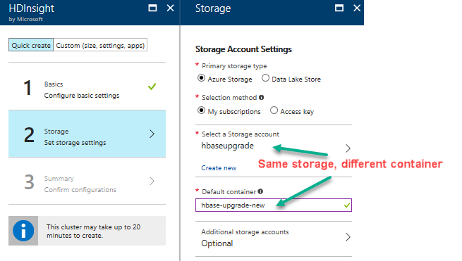
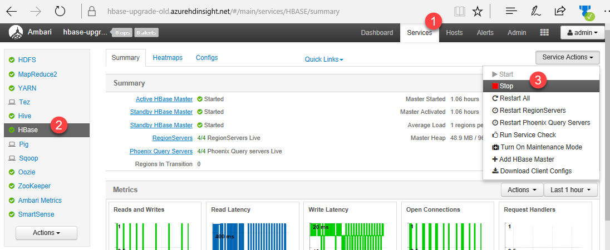
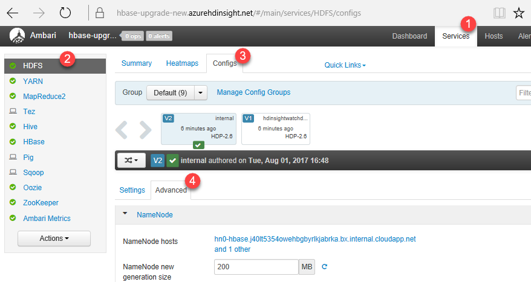

# HBase - Migrating to a New Version

The process of upgrading HDInsight clusters is [straightforward for most cluster types](hdinsight-upgrade-cluster.md), such as Spark and Hadoop. Since these are job-based clusters, the steps to conduct are to back up transient (locally stored) data, delete the existing cluster, create a new cluster in the same VNET subnet, import transient data, and start jobs/continue processing on the new cluster.

Since HBase is a database, there are additional steps one must take in order to upgrade. The general steps leading up to the actual upgrade workflow remain the same, such as planning and testing. This article covers the additional steps required for a successful HBase upgrade with minimal downtime.

## Review HBase compatibility

One crucial step to take before upgrading HBase is to review any incompatibilities between major and minor versions of HBase. The steps following this section only work if there are no version compatibility issues between the source and destination clusters. We **_highly recommend that you review the [HBase book](https://hbase.apache.org/book.html#upgrading) before undertaking an upgrade_**, specifically the compatibility matrix contained within.

Here is an example of the compatibility matrix:

| Compatibility Type | Major | Minor | Patch |
| --- | --- | --- | --- |
| Client-Server wire Compatibility | N | Y | Y |
| Server-Server Compatibility | N | Y | Y |
| File Format Compatibility | N | Y | Y |
| Client API Compatibility | N | Y | Y |
| Client Binary Compatibility | N | N | Y |
| **Server-Side Limited API Compatibility** |  |  |  |	 
| Stable | N | Y | Y |
| Evolving | N | N | Y |
| Unstable | N | N | N |
| Dependency Compatibility | N | Y | Y |
| Operational Compatibility | N | N | Y |


> Please note that the above indicates what _could_ break, not necessarily what _will_ break. Specific breaking changes should be outlined within the version release notes.

## HDInsight upgrade with same HBase major version

The following scenario is for upgrading from HDInsight 3.4 to 3.6 with the same HBase major version. The same general steps can be followed when upgrading other version numbers, provided no compatibility issues between versions.

1. Make sure that your application works with the new version. This can be done by first checking the compatibility matrix and release notes, as outlined in the previous section. You may also test your application in a cluster running the target version of HDInsight and HBase.
2. Create a [new HDInsight cluster](hdinsight-hadoop-provision-linux-clusters.md), using the same storage account, but with a different container name.

	

3. Flush your source HBase cluster. This is the cluster from which you are upgrading. Run the following script, the latest version of which can be found on [GitHub](https://raw.githubusercontent.com/Azure/hbase-utils/master/scripts/flush_all_tables.sh):

```bash
#!/bin/bash

#-------------------------------------------------------------------------------#
# SCRIPT TO FLUSH ALL HBASE TABLES.
#-------------------------------------------------------------------------------#

LIST_OF_TABLES=/tmp/tables.txt
HBASE_SCRIPT=/tmp/hbase_script.txt
TARGET_HOST=$1

usage ()
{
	if [[ "$1" == "-h" ]] || [[ "$1" == "--help" ]]
	then
		cat << ...

Usage: 

$0 [hostname]

	Note: Providing hostname is optional and not required when script 
	is executed within HDInsight cluster with access to 'hbase shell'.

	However host name should be provided when executing the script as 
	script-action from HDInsight portal.

For Example:

	1.	Executing script inside HDInsight cluster (where 'hbase shell' is 
		accessible):

		$0 

		[No need to provide hostname]

	2.	Executing script from HDinsight Azure portal:

		Provide Script URL.

		Provide hostname as a parameter (i.e. hn0, hn1 or wn2 etc.).
...
		exit
	fi
}

validate_machine ()
{
	THIS_HOST=`hostname`

	if [[ ! -z "$TARGET_HOST" ]] && [[ $THIS_HOST  != $TARGET_HOST* ]]
	then
		echo "[INFO] This machine '$THIS_HOST' is not the right machine ($TARGET_HOST) to execute the script."
		exit 0
	fi
}

get_tables_list ()
{
hbase shell << ... > $LIST_OF_TABLES 2> /dev/null
	list
	exit
...
}

add_table_for_flush ()
{
	TABLE_NAME=$1
	echo "[INFO] Adding table '$TABLE_NAME' to flush list..."
	cat << ... >> $HBASE_SCRIPT
		flush '$TABLE_NAME'
...
}

clean_up ()
{
	rm -f $LIST_OF_TABLES
	rm -f $HBASE_SCRIPT
}

########
# MAIN #
########

usage $1

validate_machine

clean_up

get_tables_list

START=false

while read LINE 
do 
	if [[ $LINE == TABLE ]] 
	then
		START=true
		continue
	elif [[ $LINE == *row*in*seconds ]]
	then
		break
	elif [[ $START == true ]]
	then
		add_table_for_flush $LINE
	fi

done < $LIST_OF_TABLES

cat $HBASE_SCRIPT

hbase shell $HBASE_SCRIPT << ... 2> /dev/null
exit
...

```

> When you write data to HBase, it is first written to an in-memory store, called a _memstore_. Once the memstore reaches a certain size, it is flushed to disk for durability. This long-term storage is the cluster's storage account. Since we will be deleting the old cluster, the memstores will go away, potentially losing data. The above script manually flushes the memstore for each table for long-term retention.

4. Stop ingestion to the old HBase cluster.
5. Flush the cluster again with the above script. This will ensure that any remaining data in the memstore is flushed. The flushing process will be faster this time around, because most of the memstore has already been flushed in the previous step.
6. Log on to Ambari (HTTPS://CLUSTERNAME.azurehdidnsight.net, where CLUSTERNAME is the name of your old cluster) and stop the HBase services. When prompted to confirm that you'd like to stop the services, check the box to turn on maintenance mode for HBase. See [Manage HDInsight clusters by using the Ambari Web UI](hdinsight-hadoop-manage-ambari.md) for more information on connecting to and using Ambari.

	

	

7. Log in to Ambari for the **new HDInsight cluster**. We need to change the `fs.defaultFS` HDFS setting to point to the container name used by the original cluster. This setting can be found under HDFS -> Configs -> Advanced -> Advanced core-site.

	

	

8. Save your changes and restart all required services (Ambari will indicate which services require restart) 
9. Point your application to the new cluster.

> Avoid having your applications rely on a static DNS name for your cluster by hard-coding it, as it will change when upgrading. There are two options we recommend to mitigate this issue: either configure a CNAME in your domain name's DNS settings that points to the cluster's name, or use a configuration file for your application that you can update without redeploying.

10. Start the ingestion to see if everything is functioning as normal.
11. Delete the original cluster after you verify everything is working as expected.

The time savings for this process can be significant versus not following this approach. In our tests, the downtime for this approach has been minimal, bringing it down from hours to minutes. This downtime is caused by the steps to flush the memstore, then the time to configure and restart the services on the new cluster. Your results will vary, depending on the number of nodes, amount of data, and other variables.


## Next steps

In this article, we covered the steps necessary to upgrade an HBase cluster. Learn more about HBase and upgrading HDInsight clusters by following the links below:

* Learn how to [upgrade other HDInsight cluster types](hdinsight-upgrade-cluster.md)
* Learn more about [connecting to and using Ambari](hdinsight-hadoop-manage-ambari.md) to manage your clusters
* Read in-depth information about [changing Ambari configs](hdinsight-changing-configs-via-ambari.md#hbase-optimization-with-the-ambari-web-ui), including settings to optimize your HBase and other HDInsight clusters
* Learn about the [various Hadoop components available with HDInsight](hdinsight-component-versioning.md)
