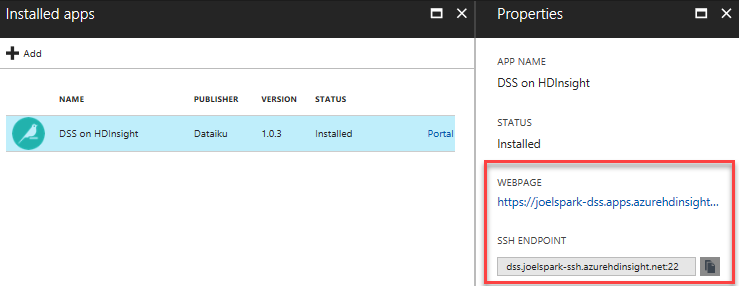
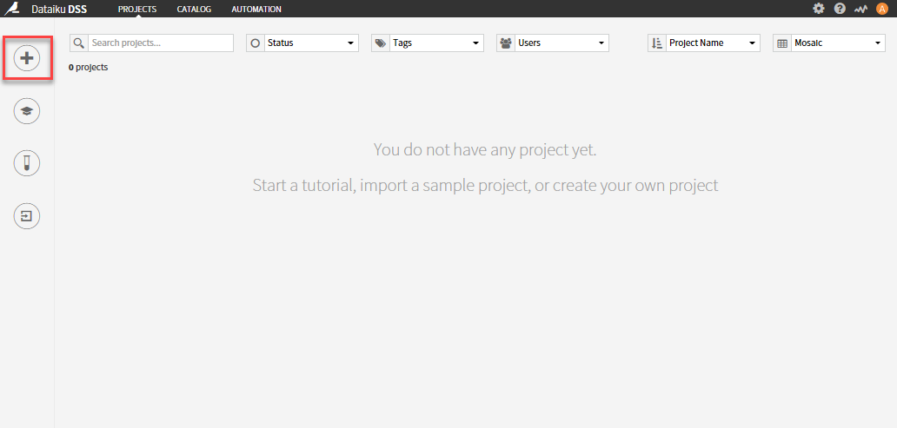
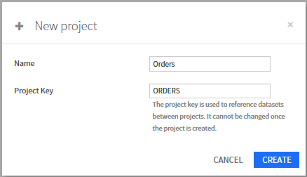
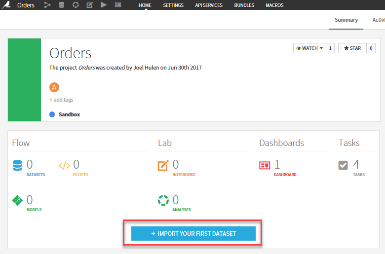
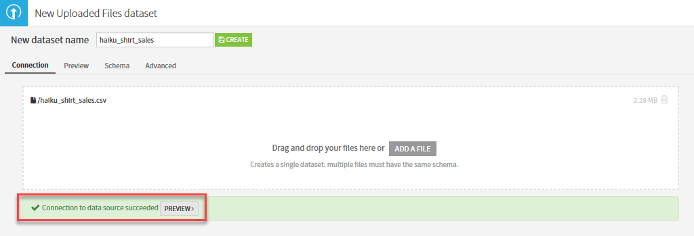
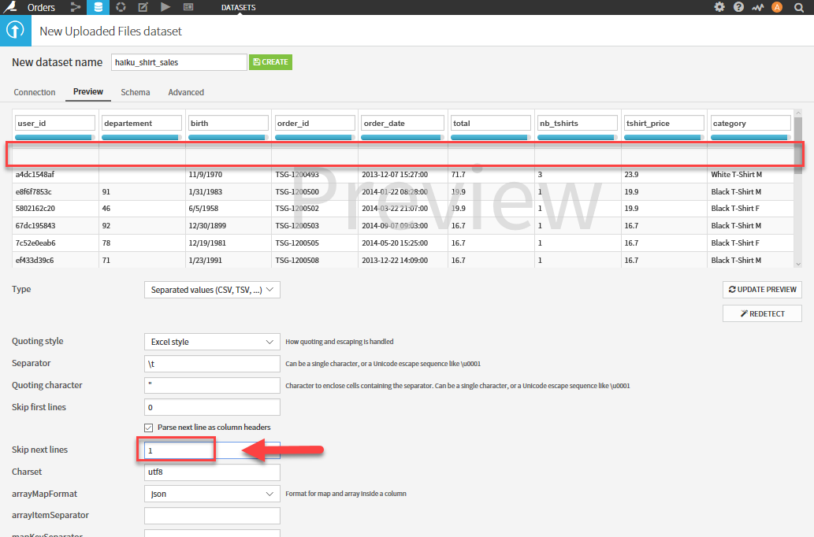
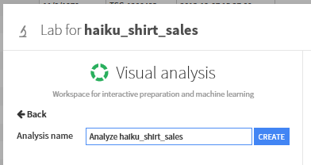
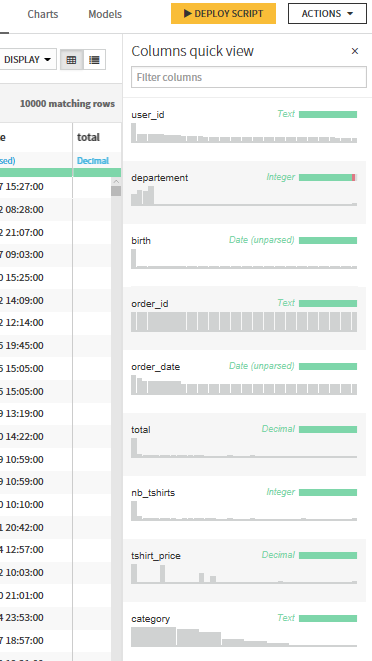

# Install published application - Dataiku DDS on Azure HDInsight

In this article, you will learn how to install the [Dataiku DDS](https://www.dataiku.com/) published Hadoop application on Azure HDInsight. Read [Install third-party Hadoop applications](hdinsight-apps-install-applications.md) for a list of available Independent Software Vendor (ISV) applications, as well as an overview of the HDInsight application platform. For instructions on installing your own application, see [Install custom HDInsight applications](hdinsight-apps-install-custom-applications.md).

## About Dataiku DSS

Dataiku develops [Data Science Studio (DSS)](https://www.dataiku.com/dss/features/connectivity/), a collaborative data science platform that enables professionals (data scientists, data engineers etc.) to build and deliver their analytical solutions more efficiently. Offering DSS as an HDInsight application enables customers to easily use data science to build big data solutions and run them at enterprise grade and scale.

A user can use DSS to implement a complete analytical solution - which could range from data ingestion (all data types, sizes, format etc.), data preparation, data processing, training and applying machine learning models, visualization and operationalizing the solution.

A customer can install DSS on HDInsight using Hadoop or Spark clusters. They can install DSS on existing clusters which are running, or while creating new clusters. DSS 4.0 also added support for using Azure Blob Storage as a connector for reading data.

When a user installs DSS on HDInsight, the user can make use of the benefits of Hadoop or Spark on HDInsight. Users can utilize DSS to build projects; the projects can generate MapReduce or Spark jobs, which makes DSS a great compliment to your HDInsight cluster. These jobs are executed as regular MapReduce or Spark jobs, and hence they get all the benefits of running these jobs on an enterprise grade platform. Since these jobs are running on HDInsight, customers can scale the cluster on demand, which allows a customer to run DSS at scale on HDInsight.

## Installing the Dataiku DSS published application

For step-by-step instructions on installing this and other available ISV applications, please read [Install third-party Hadoop applications](hdinsight-apps-install-applications.md#how-to-install-a-published-application).

## Prerequisites

When creating a new HDInsight cluster, or to install on an existing one, you must have the following configuration to install this app:

* Cluster tier(s): Standard, Premium
* Cluster type(s): Hadoop, Spark
* Cluster version(s): 3.4, 3.5

## Launching Dataiku DSS for the first time

After installation, you can launch DSS from your cluster in Azure Portal by going to the the **Settings** blade, then clicking **Applications** under the **General** category. The Installed Apps blade lists all the installed applications.

When you select DSS on HDInsight, you'll see a link to the web page, as well as the SSH endpoint path. Select the WEBPAGE link.

On first launch, you'll be presented with a form to create a new Dataiku account for free, or to sign in to an existing account. You'll also have the option to start a free 2-week trial of [Enterprise Edition](https://www.dataiku.com/dss/editions/). From this point, you have the option of continuing with entering a license key for Enterprise Edition, or using the Community Edition.

After completing your selected license option, you'll be presented with a login form. Enter the default credentials displayed prior to the login form.

Now that you've logged into Dataiku DSS, please follow these steps for a simple demonstration:

* [Download the sample orders CSV](https://doc.dataiku.com/tutorials/data/101/haiku_shirt_sales.csv).
* From the DSS dashboard, click the **+** (New project) link on the left-hand menu to create a new project.

    

* In the New project form, type in a **Name**. The **Project Key** will be automatically filled with a suggested value. In this case, enter "Orders". Click **CREATE**.

    

* Click **+ IMPORT YOUR FIRST DATASET** in your new project page.

    

* Select **Upload your files** under the **Files** dataset list. You are presented with the Upload dialog. Click on Add a file, select the `haiku_shirt_sales.csv` file you downloaded, and validate.

* The file is uploaded to DSS. Let’s now check if DSS detected our CSV format correctly by clicking on the Preview button:

    

* The import is almost perfect. The CSV has been detected using a Tab separator. You can see the data is in a tabular format, with colums called features and lines which represent observations. One thing is wrong with our dataset though… Apparently the file contained a blank line between the header and the data. Let’s just input 1 in the Skip next lines to sort this out:

    

* We can now give our new dataset a name. Enter **haiku_shirt_sales** in the field on top of the screen. Finally, we need to save our work by either hitting the **Create** button or using the shortcut Ctrl-S.

* Your dataset has been created, and you are now taken to a tabular view of your data where you can start exploring it.
For each column, you should see that Dataiku Science Studio has detected a meaning, in _blue_ (in our case Text, Number or Date (unparsed)). A gauge indicates the ratio of the column for which the values do not seem to match the meaning (in red) or are completey missing (blank). In our dataset, for example, the department has empty values, as well as invalid data.

    

## Data manipulation

The Data Scientists’ Murphy’s law states that real world data is never in the right format. Cleaning it up usually consists of a chain of scripts with a lot of business logic, that are always difficult to maintain. Sadly, a large part of the job of the Data Scientist is to clean up data. Dataiku DSS has a dedicated tool to make this task more user-friendly.

Let’s get started with data manipulation:

* Click on **Lab** in the upper-right corner.

    

* The Lab window opens. The lab is where you will iteratively work on your dataset to get further into it. In this tutorial, we are going to use the Visual analysis part of the Lab. Click on the **New** button below Visual analysis. You will be prompted to specify a name for your analysis. Let’s leave the default name for now, then click **CREATE**.

    

* Now let's quickly make sense of our data by clicking on the **Quick columns stats** button on the upper-right corner of the page as shown:

    

* You will see statistics based on data type and values displayed in timeline-based graphs under the **Columns quick view** pane.

    

That's it for now. DSS is such a powerful tool with an intuitive interface, it won't take you very long to create visualizations for this data, figure out ways to clean up the data, and work with it in a multitude of ways.

To view the complete tutorial, along with others that go into greater detail, visit the [Learn Dataiku DSS](https://www.dataiku.com/learn/) page next.

## Next steps
* Read the Dataiku DSS [reference docs](https://doc.dataiku.com/dss/latest/).
* [Install custom HDInsight applications](hdinsight-apps-install-custom-applications.md): learn how to deploy an un-published HDInsight application to HDInsight.
* [Publish HDInsight applications](hdinsight-apps-publish-applications.md): Learn how to publish your custom HDInsight applications to Azure Marketplace.
* [MSDN: Install an HDInsight application](https://msdn.microsoft.com/library/mt706515.aspx): Learn how to define HDInsight applications.
* [Customize Linux-based HDInsight clusters using Script Action](hdinsight-hadoop-customize-cluster-linux.md): learn how to use Script Action to install additional applications.
* [Use empty edge nodes in HDInsight](hdinsight-apps-use-edge-node.md): learn how to use an empty edge node for accessing HDInsight cluster, testing HDInsight applications, and hosting HDInsight applications.

