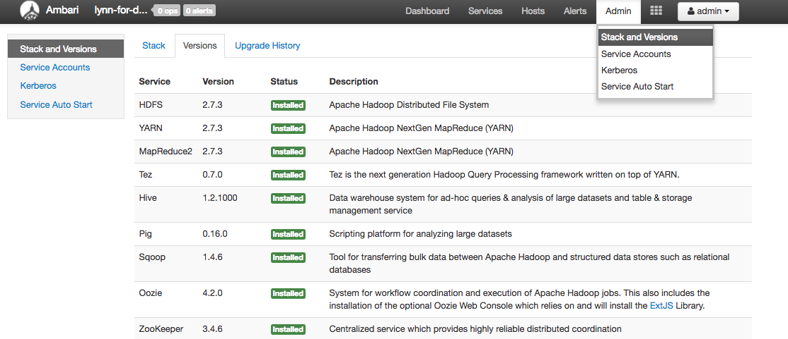
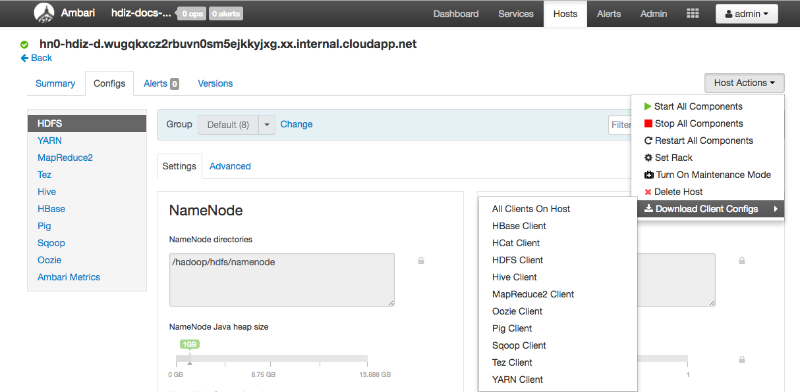
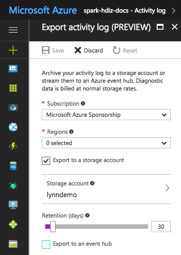

# Managing Logs for a HDInsight Cluster

This article provides guidance on management of the myriad log files that a HDInsight cluster produces.  Apache Hadoop and related services, such as Apache Spark, produce detailed job execution logs. Properly managing these log files is an important aspect of maintaining a healthy HDInsight cluster. The management of these files can also be dictated by regulatory requirements.  Also, due to number and size of logs, you want to optimize log storage and archival for service cost management.

There are a set of general steps to take when managing HDInsight cluster logs.  They include retaining information about all aspects of the environment.  This includes, but is not limited to,  all associated Azure Services, cluster configuration, job execution information and any error states.  The most common steps taken in this process are listed below.

### Managing HDInsight Cluster Log Steps  
* Step 1: Determine log retention policies
* Step 2: Manage cluster service versions configuration logs
* Step 3: Manage cluster Job Execution Log Files 
* Step 4: Forcast log volume storage sizes and costs
* Step 5: Determine log archive policies and processes

---

## Step 1: Determine log retention policies
The first step in creating a HDInsight cluster(s) log management strategy is to gather information about business scenarios and job execution (log) history storage requirements. You will use this information to design and implement your cluster log management practices.

#### Cluster Details
The following cluster details are useful in helping to gather information in your log management strategy.  It's important to gather this information from 
EVERY HDInsight cluster you have provisioned into the Azure account that are you are working with to when designing your log management strategy.
* Name of the cluster
* Region and availability zone the cluster was launched into.
* State of the cluster, including details of the last state change.
* Type and number of HDInsight instances specified for the master, core, and task nodes.

You can quickly get much of this top level information via the Azure portal.  Alternatively, you can use the Azure cli to get information about your HDInsight cluster(s) by running the following commands:

```
    azure hdinsight cluster list
    azure hdinsight cluster show <Cluster Name>
```
Or, you can use powershell to view this type of information.  See [Manage Hadoop clusters in HDInsight by using Azure PowerShell](https://docs.microsoft.com/en-us/azure/hdinsight/hdinsight-administer-use-powershell) for details.

#### Understand the Workloads running on your clusters
It's important to understand workload types running on your HDInsight cluster(s) so that you can design appropriate associated logging strategies for each type of workload.  
Listed below are some of the questions you can use to capture the needed information for planning.
* Are the workloads experimental (i.e. dev or test) or production-quality?
* How often do the production-quality workloads normally run?
* Are any of the workloads resource-intensive and/or particularly long-running?
* Do any of the workloads utilize a complex set of Hadoop services for which multiple types of logs would be produced?
* Do any of the workloads have associated regulatory execution lineage requirements?

Your expected output after you complete the information-gathering in this step is a written list of cluster(s) information, workload types and log retention requirements.

#### Example log retention patterns and practices
* Consider maintaining data lineage tracking by adding an identifier to each log entry, or through other techniques. This allows you to trace back the original source of the data and the operation, and follow it through each stage to understand its consistency and validity.
* Consider how you can collect logs from the cluster, or from more than one cluster, and collate them for purposes such as auditing, monitoring, planning, and alerting. You might use a custom solution to access and download the log files on a regular basis, and combine and analyze them to provide a dashboard-like display with additional capabilities for alerting for security or failure detection. Such utilities could be created using PowerShell, the HDInsight SDKs, or code that accesses the Azure Service Management API.
* Consider if a monitoring solution or service would be a useful benefit. A management pack for HDInsight is available for use with Microsoft System Center (see the Microsoft Download Center for more details). In addition, you can use third-party tools such as Chukwa and Ganglia to collect and centralize logs. Many companies offer services to monitor Hadoop-based big data solutions—some examples are Centerity, Compuware APM, Sematext SPM, and Zettaset Orchestrator.

---

## Step 2: Manage cluster service versions and view Script Action logs
A typical HDInsight cluster uses a number of services and open-source software packages (such as Apache HBase, Apache Spark, etc...). For some workloads, such as bioinformatics, you may be required to retain service configuration log history in addition to job execution logs.

### Viewing Cluster Configuration Settings with the Ambari UI
Apache Ambari simplifies the management and monitoring of a HDInsight cluster by providing an easy to use web UI and REST API. 
Ambari is included on Linux-based HDInsight clusters, and is used to monitor the cluster and make configuration changes.
Click on the 'Cluster Dashboard' blade on the Azure Portal HDInsight page to open the 'Cluster Dashboards' link page.  Next, click on 
the 'HDInsight cluster dashboard' blade to open the Ambari UI.  You'll be prompted for your cluster login credentials.  

Also, you can click the blade named 'Ambari Views' on the Azure portal page for HDInsight to open a list of service views.  This list will vary, depending on which libraries you've installed.  For example, you may see YARN Queue Manager, Hive View and Tez View, if you've installed these services.  Click any service link of interest to drill down to see configuration and service information.  The Ambari UI 'Stack and Version' page provides information about the cluster services configuration and service version history.  In the Ambari UI, click on the 'Admin' menu and then on 'Stacks and Versions' to navigate to this section.  Then click on the 'Versions' tab on the page to see service version information.  An example is shown below.



Additionally, using the Ambari UI, you can capture (by downloading) the configuration for any (or all) services running on a particular host (or node) in the cluster.   
Do this by clicking on the 'Hosts' menu, then on link for the host of interest and then in that host's page, on the 'Host Actions' button and then on 'Download Client Configs'. An example screenshot is shown below.



#### Viewing the Script Action Logs
HDInsight [Script Actions](https://docs.microsoft.com/en-us/azure/hdinsight/hdinsight-hadoop-customize-cluster-linux) run scripts on the cluster manually or when specified. For example, they can be used to install additional software on the cluster or to alter configuration settings from the default values. These logs may provide insight into errors that occurred during set up of the cluster as well as configuration settings changes that could affect cluster performance and availability.  You can view the status of a script action by clicking on the 'ops' button on your Ambari UI or by accessing them from the default storage account.
The storage logs are available at `/STORAGE_ACCOUNT_NAME/DEFAULT_CONTAINER_NAME/custom-scriptaction-logs/CLUSTER_NAME\DATE`.

---

## Step 3: Manage the Cluster Job execution log files
The next step is to review the job execution log files for the various services you may be using.  Services could include Apache HBase, Apache Spark and many others. A Hadoop cluster produces a large number of verbose logs, so determining which log are useful (and which are not) can be time-consuming.  Understanding the logging system is important so that you can target management of useful log files.  For perspective, an example log is shown below.


### Accessing the Hadoop-generated log files
HDInsight stores its log files in both the cluster file system and in Azure storage. You can examine log files in the cluster by opening an SSH connection to the cluster and browsing the file system or by using the Hadoop YARN Status portal on the remote head node server. You can examine the log files in Azure storage using any of the tools that can access and download data from Azure storage. Examples are AZCopy, CloudXplorer, and the Visual Studio Server Explorer. You can also use powershell and the Azure Storage Client libraries, or the Azure .NET SDKs, to access data in Azure blob storage.

Hadoop runs the work of the jobs in task attempts on various nodes in the cluster. HDInsight can initiate speculative task attempts, terminating the other task attempts that do not complete first. This generates significant activity that is logged to the controller, stderr and syslog log files as it happens. In addition, multiple tasks attempts are running simultaneously, but a log file can only display results linearly.  

#### HDInsight Logs written to Azure Tables
The logs written to Azure Tables provide one level of insight into what is happening with an HDInsight cluster.
When you create an HDInsight cluster, 6 tables are automatically created for Linux-based clusters in the default Table storage:
* hdinsightagentlog
* syslog
* daemonlog
* hadoopservicelog
* ambariserverlog
* ambariagentlog

#### HDInsight Logs Written to Azure Blob Storage
HDInsight clusters are configured to write task logs to an Azure Blob Storage account for any job that is submitted using the Azure PowerShell cmdlets or the .NET Job Submission APIs.  If you submit jobs through SSH to the cluster then the execution logging information will be found in the Azure Tables discussed in the previous paragraph.
In addition to the core log files, generated by HDInsight, services that are installed, such as YARN, will also generate job execution log files.  The number and type of log files depends of the services installed.  Common services are Apache HBase, Apache Spark and more.  You will want to investigate the job log execution files for each service 
in order to understand the overall logging files available on your cluster.  Each service has it's own unique methods of logging and locations for storing log files.  As an example, detail about accessing the most commong service log files (YARN) is discussed in the next section.

### HDInsight Logs genered by YARN
YARN aggregates logs across all containers on a worker node and stores them as one aggregated log file per worker node. The log is stored on the default file system after an application finishes. Your application may use hundreds or thousands of containers, but logs for ALL containers run on a single worker node are always aggregated to a single file. So there is only one log per worker node used by your application. Log Aggregation is enabled by default on HDInsight clusters version 3.0 and above. Aggregated logs are located in default storage for the cluster. The following path is the HDFS path to the logs:

```
    /app-logs/<user>/logs/<applicationId>
```

The aggregated logs are not directly readable, as they are written in a TFile, binary format indexed by container. Use the YARN ResourceManager logs or CLI tools to view these logs as plain text for applications or containers of interest.

##### YARN CLI tools
To use the YARN CLI tools, you must first connect to the HDInsight cluster using SSH. Specify the `<applicationId>`, `<user-who-started-the-application>`, `<containerId>`, and `<worker-node-address>` information when running these commands.
You can view these logs as plain text by running one of the following commands:

```bash
    yarn logs -applicationId <applicationId> -appOwner <user-who-started-the-application>
    yarn logs -applicationId <applicationId> -appOwner <user-who-started-the-application> -containerId <containerId> -nodeAddress <worker-node-address>
```

##### YARN ResourceManager UI
The YARN ResourceManager UI runs on the cluster headnode. It is accessed through the Ambari web UI. Use the following steps to view the YARN logs:
1. In your web browser, navigate to https://CLUSTERNAME.azurehdinsight.net. Replace CLUSTERNAME with the name of your HDInsight cluster.
2. From the list of services on the left, select YARN.
Yarn service selected
3. From the Quick Links dropdown, select one of the cluster head nodes and then select ResourceManager logs. You are presented with a list of links to YARN logs.

---

## Step 4: Forecast log volume storage sizes and costs

After you've completed the previous steps you will have gained an understanding of the types and volumes of log files that your HDInsight cluster(s) are producing.  
Next, you should analyze the volume of log data in key log storage locations over a period of time. For example, if you have the data, it's common to analyze volume and growth over 30-60-90 day periods.  Record this information in a spreadsheet or you can use other tools such as Visual Studio, the Azure Storage Explorer or Power Query for Excel.  
See [Analyze HDInsight Logs](https://docs.microsoft.com/en-us/azure/hdinsight/hdinsight-debug-jobs) for details.  Using this information you can now forecast potential future log volume growth and associated Azure service (storage) costs.  

You now have enough information to create log management strategy for key logs.  To do this, use your spreadsheet(or tool or choice) to forecast both log size growth and also log storage Azure service costs going forward.  Next, apply your undestanding of log retention requirements to the set of logs that you are examining.  Now you can re-forecast 
future log storage costs, after you've determined which log files can be deleted (if any) and which should be retained and archived to less expensive (i.e. cool) Azure storage.

----

## Step 5: Determine log archive policies and processes

After you determine which log files can be deleted, you can adjust logging parameters on many Hadoop services to automatically delete log files after a specified time period.

For certain log files, you may wish to execute a lower-priced log file archiving approach. For Azure Resource Manager activity logs, you can explore this approach first via the Azure Portal.  You can setup archiving of the ARM logs by clicking on the 'Activity Log' link in the Azure portal for your HDInsight instance.  On the top of the Activit Log search page click on the 'Export' menu item.  This opens the 'Export activity log' blade.  You then fill in the subscription, region and whether you'd like to export to a storage account and for how many days you'd like the logs to be retained. On this same blade you can also indicate whether you'd like to export to an event hub. An example screen is shown below.



Alternatively, you can script log archiving by using powershell.  A Sample powershell script to [Archive Azure Automation logs to Azure BLOB Storage](https://gallery.technet.microsoft.com/scriptcenter/Archive-Azure-Automation-898a1aa8) can be found at the link referenced.

### Accessing Azure storage metrics
Azure storage can be configured to log storage operations and access. You can use these logs, which contain a wealth of information, for capacity monitoring and planning, and for auditing requests to storage. The information includes latency details, enabling you to monitor and fine tune performance of your solutions.
You can use the .NET SDK for Hadoop to examine the log files generated for the Azure storage that holds the data for an HDInsight cluster. 

### Control the Size and Number of backup index of old log files
Do this by using the following properties of the `RollingFileAppender` to efficiently control the Size and the number of log files retained.

```
    maxFileSize:This is the critical size of the file above which the file will be rolled. Default value is 10 MB.
    maxBackupIndex: This property denotes the number of backup files to be created. Default value is 1.
```
### Other log management techniques
To avoid running out of disk space, you may want to use some OS tools to let them manage handling of log files, e.g. logrotate. You can configure it to run on a daily basis, compressing log files and remove old ones. But this behaviour highly depends on your requirements, e.g. how long do you want to keep the logfiles on local nodes. You can also check if you have DEBUG logging enabled in one of your services where you do not need it, which will increase the size of log output heavily. If you want to collect the logs from all the nodes to one central location for much easier diving into issues, you could create a data flow e.g. ingesting all the log entries into Solr.

----

## Conclusion

There are a number of considerations you need to take into account when creating and implementing your HDInsight cluster log management policies.  You should focus on using the best HDInsight log policy for each of your particular workload types running your cluster.  Along with that, you'll need to monitor the size of key log files for the execution of long-running job executions to make sure that they don't exceed the expected size.  This is not only so that you have predictable costs, but also for performance and service availability.  It's also critically important to manage your cluster configuration files over time as part of your log management strategy, so that you can revert to working state should the need arise.

## See also

* [Monitoring and Logging Practice for HDInsight](https://msdn.microsoft.com/en-us/library/dn749790.aspx)
* [Access YARN application log on Linux-based HDInsight](https://docs.microsoft.com/en-us/azure/hdinsight/hdinsight-hadoop-access-yarn-app-logs-linux)
* [How to control size of log files for various Hadoop components](https://community.hortonworks.com/articles/8882/how-to-control-size-of-log-files-for-various-hdp-c.html)


